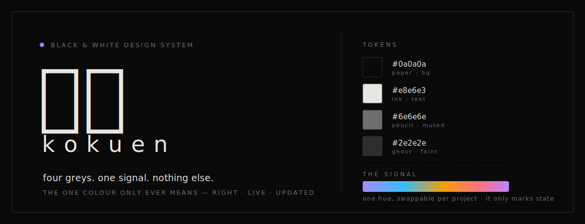

<p align="center"><em>black &amp; white. four greys, one signal, nothing else.</em></p>

---

**kokuen** (黒鉛, *graphite*) is a near-black web design system. The whole UI is drawn in four shades
of grey on near-black paper — warm bone-white in light mode — and **there is no accent**. The only
non-grey on screen is a single **signal**: a sign that something is *right*, *live*, or *updated*.
Like a proofreader's tick, not a brand colour. The signal hue is swappable per project; everything
else is fixed.

It's the house style behind [jxherc/website](https://github.com/jxherc/website) and `alles` — both
monochrome UIs where colour only ever reports state. This repo is that style pulled out so anything
new can speak it.

## quickstart

```html
<link rel="stylesheet" href="kokuen.css">
```
```css
:root{ --signal:#818cf8; }   /* the only thing you set per project — and it only marks state */
```

```html
<button class="btn">save</button>
<span class="live-dot"></span>          <!-- pulsing: "live / now" -->
<div class="switch on" aria-checked="true"></div>
<div class="chk" role="checkbox" aria-checked="true"></div>
```

Set `--signal`, write your markup against the documented class names, done. No build step, no deps.

## the 9 laws

1. **Black &amp; white — the only colour is a signal.** No decorative accent. One non-grey hue, and it's *semantic*: right / live / updated / on. Most screens show zero or one.
2. **Inter for words, JetBrains Mono for data.** `font-feature-settings:'cv11','ss01','ss03'`, antialiased.
3. **Letter-spacing has two modes.** Prose &amp; headings tight (negative); labels &amp; buttons wide + lowercase (positive). This contrast is the strongest tell.
4. **Everything is small.** UI text lives at 0.6–0.9rem.
5. **Micro-radii only.** `border-radius` 1–4px. The only pill is a real toggle.
6. **1px faint borders that wake on hover** (`--faint` → `--muted`). Flat surfaces, no shadows.
7. **One easing for everything that moves:** `cubic-bezier(0.2,0.7,0.2,1)`.
8. **Numbers are `tabular-nums`.**
9. **No native chrome — ever.** Build the checkbox, toggle, slider, select, scrollbar yourself.

## tokens

```css
:root{
  --bg:#0a0a0a; --text:#e8e6e3; --muted:#6e6e6e; --faint:#2e2e2e;   /* the graphite ramp */
  --panel:#0e0e0e;                                                   /* raised / hover surface */
  --signal:#818cf8;          /* the one non-grey — status only. swap per project */
  --error:#f87171; --green:#4ade80;
}
[data-theme="light"]{
  --bg:#f5f4f1; --text:#111111; --muted:#888888; --faint:#d4d2ce; --panel:#efede9;
}
```

`--bg → --faint` is the ramp: **paper · ink · pencil · ghost**. Light mode is warm paper, not white —
keep the warmth.

## what's inside

| file | what |
|------|------|
| [`kokuen.css`](kokuen.css) | drop-in: tokens, reset, base type, thin scrollbars, inverted selection, focus rings, the `rise` / `live-pulse` / `fade-in` keyframes, and every custom control (button, toggle, checkbox, slider, ghost input). |
| [`reference.md`](reference.md) | the full catalog: palette &amp; type explained, every component, the custom-control recipes, a motion cheatsheet, a light-mode checklist, and a 10-point ship smell-test. |
| [`SKILL.md`](SKILL.md) | the same system as a [Claude Code](https://claude.com/claude-code) skill — drop the folder in `~/.claude/skills/kokuen/` and Claude applies the style on request. |

---

<sub>MIT · built by [jxherc](https://github.com/jxherc) · 黒鉛</sub>
